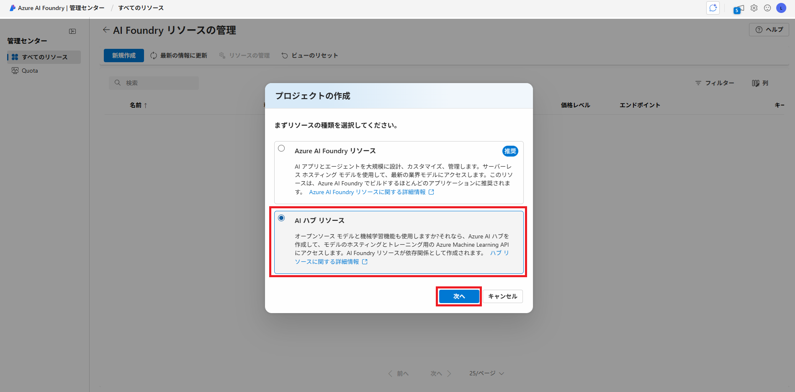

# ラボ 00 - 演習リソース作成

## タスク1 : Azure AI Foundryへのアクセス

このタスクでは、Microsoft AzureにおけるAIサービスを統合的に管理するAzure AI Foundryへアクセスします。
各演習ではAzure AI Foundry上で演習に使用するリソースを作ります。

1. 新しい InPrivate ブラウザー ウィンドウを開きます。

   > 　  どのWebブラウザもウィンドウ右上の設定ボタンから表示することが可能です。
   >
   > 　  Microsoft Edgeでは「InPrivate」ウィンドウ
   >
   > 　  Google Chromeでは「シークレット」ウィンドウ
   >
   > 　  Mozilla Fire Foxでは「プライベート」ウィンドウ

2. https://ai.azure.com/managementCenter/allResources へアクセスし、以下のアカウントでサインインします。
   > 　  URLをコピーして開いておいたInPrivate ブラウザー ウィンドウに貼り付けてください

   > 注：XXは受講者ごとに異なります。講師より配布します。
   >
   > 注：「アカウントの保護にご協力ください」と表示された場合は「今はしない」を選択してください

   | 項目       | 値                                           |
   | ---------- | -------------------------------------------- |
   | ユーザーID | `AI900StudentXX@ctctedu.onmicrosoft.com` |
   | パスワード | 講師から配布されたパスワード                 |

    >**注:** ツアーやチュートリアルが表示される場合は、"キャンセル"もしくはポップアップの×ボタンをクリックして閉じます。
    >
    >Azure AI Foundryの言語が英語になっている場合は、ログイン後の画面上部右側"歯車アイコン"をクリックし、画面左側の"Language + Regions"から日本語(Japanese)へ変更することが可能です。

## タスク2 : 演習リソース作成

このタスクでは、演習で使用するリソースのために**プロジェクトとハブリソース** を作成します。 Azure AI Foundry では、プロジェクトを作業の整理を行うためのコンテナーとして使用します。

1. 管理センター上部に表示されている **新規作成** ボタンをクリックし、**プロジェクトの作成** 画面に移動します。

1. **プロジェクトの作成** 画面では、 **AIハブリソース** を選択して **次へ** をクリックします。

    

1. **新しいプロジェクトの作成** の画面が表示されたら、プロジェクト名・ハブはそのまま変更なしにします。
高度なオプションを展開して以下のパラメーターを設定します。

    | パラメーター       | 値                                                           |
    | ------------------ | ------------------------------------------------------------ |
    | リソースグループ   | **AI900StudentXX**（XXは自身の番号）                               |
    | リージョン         | **East US**（注意：East US以外を選ぶとエラーになります） |

1. **[作成]** をクリックしてプロジェクトの作成を開始します。

    ※プロジェクトの作成には時間を要する場合があります。概ね3-5分程度で作成が完了します。

1. プロジェクトの作成が完了すると、 **Azure AI Foundry Portal** へ強制的に遷移します。

    > 注：強制的に遷移されなかった場合は、以下のURLにアクセスすることで確認可能です。
    > https://ai.azure.com/

以上で、演習リソースの作成は完了です。

