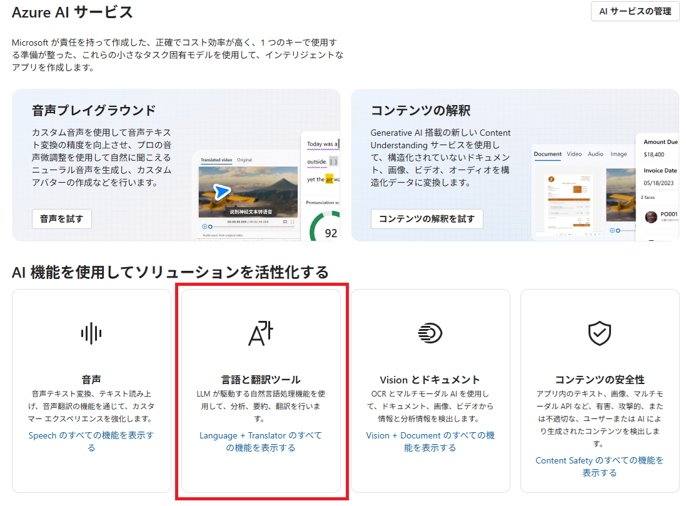
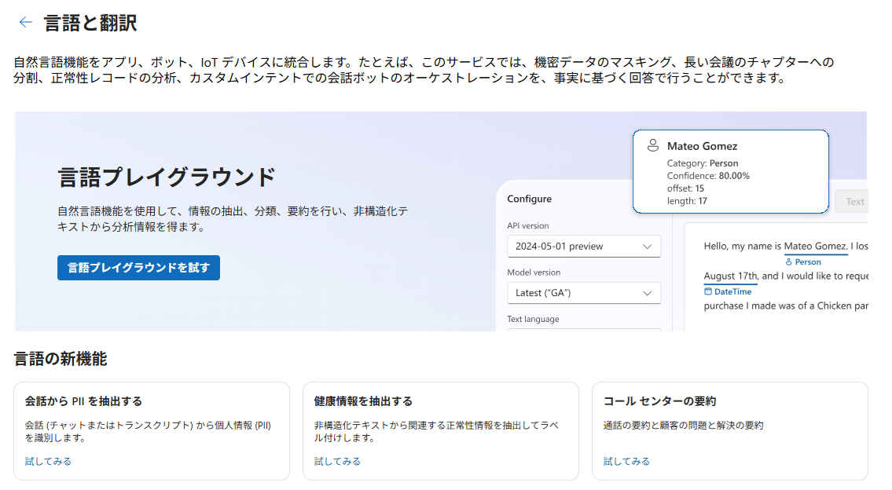
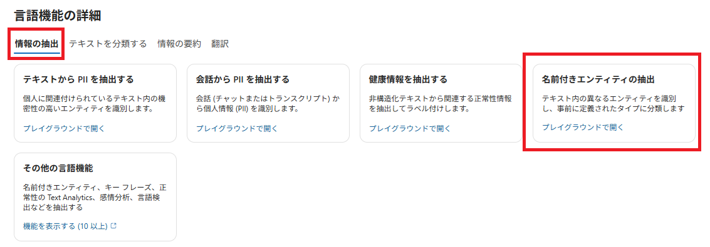
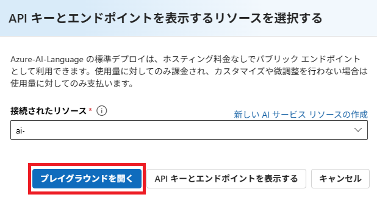
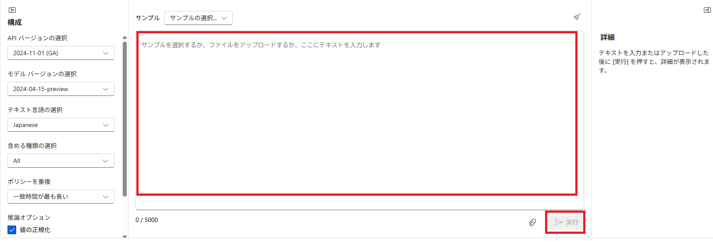
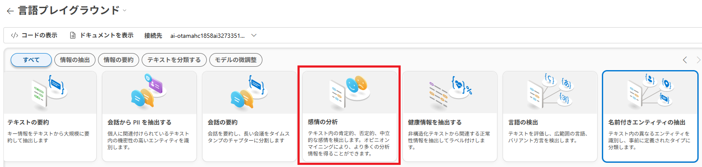
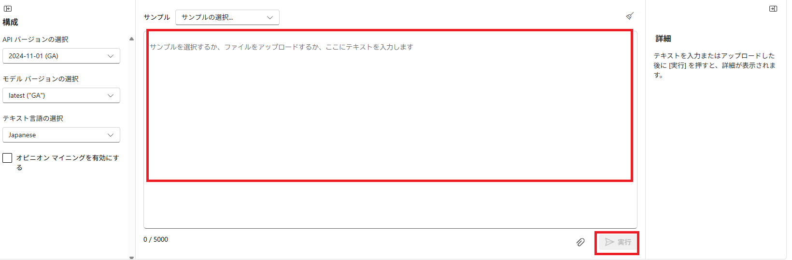
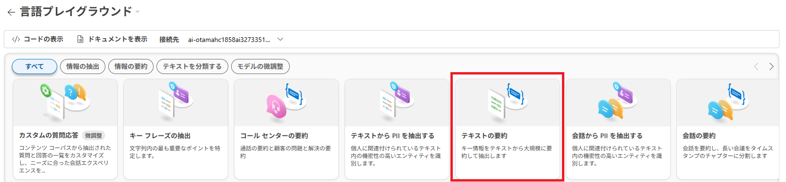

---
lab:
  title: 'ラボ 02: Analyze text'
  module: Module03 Natural Language Processing
---

# ラボ 02 - Languageを使用してテキストを分析する

## ラボ概要

Azure AI Servicesには自然言語処理(Natural Language Processing)を実行するソリューションが存在しています。Azure AI Language Serviceにはテキスト分析や自然言語処理の機能が含まれおり、テキスト内のキーフレーズ識別や、感情に基づいたテキストの分類を実行することが可能です。

このラボではAzure AI Foundry Portalを使用してテキストに対する自然言語分析の機能を確認します。

## 推定時間 : 20 分

## 演習リソース作成

　 [**Lab00の手順**](./LAB_00-Startup_Hands-on_Lab.md)  に従って、リソースを作成してください。
 - すでに実施済みの場合は、次の手順に進んでください。

## タスク1 : Azure AI Languageへのアクセス

1. 作成したプロジェクトにアクセスをします。Azure AI Foundry Portalの左側に表示されるメニューから **AIサービス** を選択します。 

   

1. 移動した **Azure AI サービス** のページで **AI機能を使用してソリューションを活性化する** のセクションから **言語と翻訳ツール** を選択します。

   

1. **言語と翻訳** の画面が表示され、Languageの機能をテストすることが可能となっていることが確認できます。

   


## タスク 2 : 名前付きエンティティの抽出

このタスクではAzure AI Foundry Portal上で名前付きエンティティの抽出を実行します。この機能では、文中に含まれている固有名詞やオブジェクトを検出することが可能です。

1. **言語機能の詳細** セクションにて、 **情報の抽出** タブに切り替えて  **[名前付きエンティティの抽出]** のタイルをクリックします。

   

2. **APIキーとエンドポイントを表示するリソースを選択する** の画面では、 **接続されたリソース** に項目が表示されていることを確認して、 **プレイグラウンドを開く** をクリックしてプレイグラウンドに移動します。

   

3. テキスト入力ボックスに以下のテキストをコピー&ペーストして入力し、 **実行** ボタンをクリックします。

   ```text
   このホテルは1950年代からある古い建物で、部屋の設備は平均的なものだが一部は交換する必要がありました。インターネットが使用できず、帰国のためのフライトのチェックインをするためにホテルのオフィスの一室に行かなければなりませんでした。ウェブサイトには大英博物館の近くと書かれていましたが、徒歩で行くには遠すぎます。
   ```

   

4. 入力したテキストに対してエンティティが検出されていることと、 **詳細** の項目にはそれぞれの種類や信頼度が表示されていることを確認します。 信頼度スコアは、識別された種類が実際にそのカテゴリに属している可能性を表します。

5. テキストの内容を以下のように書き換えて再度分析を実行します。テキストを書き換えるには、テキスト入力ボックス右上の **鉛筆アイコン** をクリックして編集可能な状態にします。

   ```text
   清潔な部屋、良いサービス、バッキンガム宮殿やウェストミンスター寺院の近くという素晴らしい立地など、私たちはこのホテルでのステイを心から楽しむことができました。
   中庭はとても静かで、同行者と一緒にインド料理レストランにも行き、西海岸特有の海鮮を楽しみました。
   部屋にはキッチン、ラウンジ、寝室、そして広大なバスルームが備わっておりとても快適でした。おすすめできるホテルです。
   ```

6. **実行** ボタンをクリックして、書き換えたテキストに対するエンティティ抽出を実行します。

7. 分析内容を確認します。今回は固有名詞がテキスト中に多く含まれるため、先ほどとは検出されたエンティティも増加していることが予想されます。

8. ページはプレイグラウンドのまま、次のタスクに移行します。


## タスク 3 : テキスト感情分析

このタスクではAzure AI Foundry Portal上でテキスト感情(Sentiment)分析を実行します。顧客からのレビューに対してのポジティブ/ネガティブな意見を分類していきます。

1. **言語プレイグラウンド** にて、  **[感情の分析]** のタイルをクリックします。

   

2. 先ほどの名前付きエンティティの抽出と同様にテキスト入力ボックスが表示されるため、以下のテキストをコピー&ペーストして入力し、 **実行** ボタンをクリックします。

   ```text
   このホテルは1950年代からある古い建物で、部屋の設備は平均的なものだが一部は交換する必要がありました。インターネットが使用できず、帰国のためのフライトのチェックインをするためにホテルのオフィスの一室に行かなければなりませんでした。ウェブサイトには大英博物館の近くと書かれていましたが、徒歩で行くには遠すぎます。
   ```

   

3. **[詳細]** の項目を確認します。テキスト全体に対する感情分析と、文節ごとの感情分析が表示されますが、今回は批判的な内容がテキスト中に多く含まれるため、 **[NEGATIVE]** の値が高く検出されます。

4. テキストの内容を以下のように書き換えて再度分析を実行します。テキストを書き換えるには、テキスト入力ボックス右上の **鉛筆アイコン** をクリックして編集可能な状態にします。

   ```text
   清潔な部屋、良いサービス、バッキンガム宮殿やウェストミンスター寺院の近くという素晴らしい立地など、私たちはこのホテルでのステイを心から楽しむことができました。
   中庭はとても静かで、同行者と一緒にインド料理レストランにも行き、西海岸特有の海鮮を楽しみました。
   部屋にはキッチン、ラウンジ、寝室、そして広大なバスルームが備わっておりとても快適でした。おすすめできるホテルです。
   ```

5. **実行** ボタンをクリックして、書き換えたテキストに対する感情分析を実行します。

6. 分析内容を確認します。今回は好意的な内容がテキスト中に多く含まれるため、先ほどとは異なり **[POSITIVE]** の値が高く検出されます。

7. ページはプレイグラウンドのまま、次のタスクに移行します。

## タスク 4 : テキストの要約

このタスクでは入力されたテキストに対する要約を行います。

1. **言語プレイグラウンド** にて、  **[テキストの要約]** のタイルをクリックします。

   

2. 次のパラメーターを指定します。

   | パラメーター       | 値                                                           |
   | ------------------ | ------------------------------------------------------------ |
   | テキスト言語の選択 | Japanese                                                     |
   | 文の数             | 3                                                            |
   | サマリーの長さ     | Single sentence                                              |
   | 入力するテキスト   | 近年、文章や画像を自動で作ってくれる「生成AI」が大きな注目を集めています。何かを調べたいとき、資料をまとめたいとき、アイデアを出したいときなど、これまで人が時間をかけて行っていた作業を、AIがあっという間に手伝ってくれるようになってきました。実際、すでに仕事の現場や教育の場でも活用が進んでおり、これから私たちの暮らしの中でもますます身近な存在になると考えられています。<br/><br/>しかし、AIがどんな場面でも完璧な答えを出してくれるわけではありません。実は、AIにうまく答えてもらうには、こちらの「聞き方」が非常に重要になります。この「聞き方」の工夫を考えることが、いま「プロンプトエンジニアリング」と呼ばれ、注目されています。<br/><br/>プロンプトエンジニアリングというと難しそうな響きですが、要するに「AIにしてほしいことを上手に伝える方法」のことです。たとえば、誰かに料理をお願いするとき、「何か作って」と言うよりも、「野菜を使った、20分以内で作れる、さっぱりした味の夕食をお願い」と伝えた方が、相手もイメージしやすく、期待に合った料理が出てきやすくなりますよね。AIに対しても、同じように目的・条件・背景をできるだけ具体的に伝えることで、より質の高い返答を引き出すことができるのです。<br/><br/>実際、プロンプトを工夫するだけで、同じAIでも返してくる答えの内容や方向性が大きく変わります。たとえば、「旅行について教えて」と聞くのと、「子ども連れの家族が楽しめる、週末に行ける自然豊かな観光地を教えて」と聞くのとでは、AIの回答もまったく違うものになります。これはAIが、人のように「空気を読む」ことがまだ得意ではなく、言葉通りに理解しようとするためです。<br/><br/>プロンプトエンジニアリングでは、いくつかの基本的なポイントがあります。<br/>まず1つ目は、誰が使うのかを明確にすること。たとえば「小学生向けに説明して」とか、「営業職の人が理解できるように」などと伝えると、AIはその対象に合わせた言葉や内容で答えようとします。<br/><br/>2つ目は、どんな形で返してほしいかを指定することです。「箇条書きで」「200文字以内で要約して」「会話形式で」など、形式を伝えることで、読みやすく目的に合ったアウトプットになります。<br/><br/>3つ目は、背景や前提を補足することです。質問だけを投げるのではなく、「こういう状況で困っている」「今はこの情報まで調べた」といった背景を伝えると、AIもそれをふまえてより適切な提案をしてくれます。<br/><br/>さらに、AIとのやり取りは一度きりで終わる必要はありません。最初の回答が思っていたものと違っても、「もっと簡単に説明して」「例を加えて」などと追加で指示を出すことで、少しずつ理想的な回答に近づけていくことができます。こうしたやり取りを通じて、AIと協力しながら考えを深めていくという姿勢が、今後はとても重要になってくるでしょう。<br/><br/>プロンプトエンジニアリングは、特別な技術者だけが行うものではありません。むしろ、日常的にAIと接する一般の人々にこそ必要なスキルです。難しい言葉を知らなくても、自分の意図を丁寧に、具体的に、相手（AI）にわかるように伝える――この力があれば、誰でも生成AIをより便利に活用できるようになります。<br/><br/>これからAIはますます高性能になっていきますが、それをどう使いこなすかは、結局のところ「人の伝え方」にかかっています。プロンプトエンジニアリングを意識することは、AIとの付き合い方をより良くするための第一歩なのです。 |

4. **[実行]** ボタンをクリックして、要約を実行します。

4. **[詳細]** の項目を確認します。テキストの要約結果を確認することができ、指定した数（今回は3つ）にまとめられた形で要約されています。また、抽象的要約として文章も生成されています。


以上でLanguageを使用したラボは完了です！
