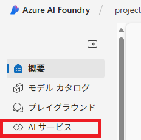
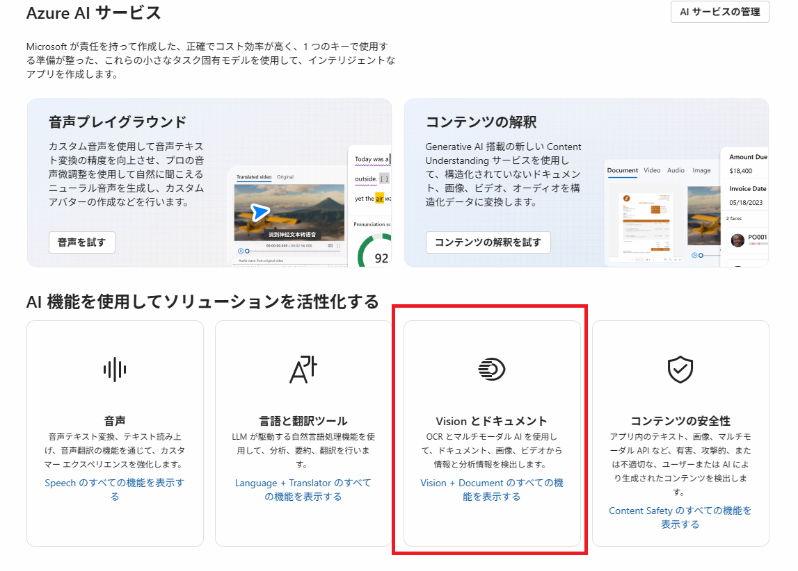
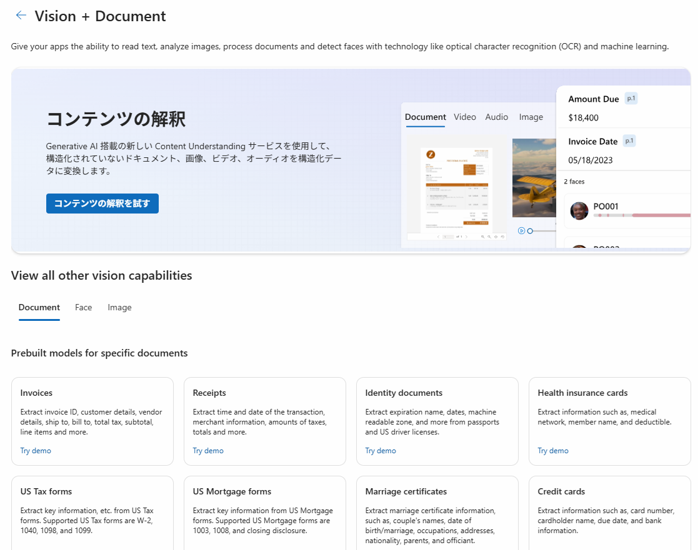
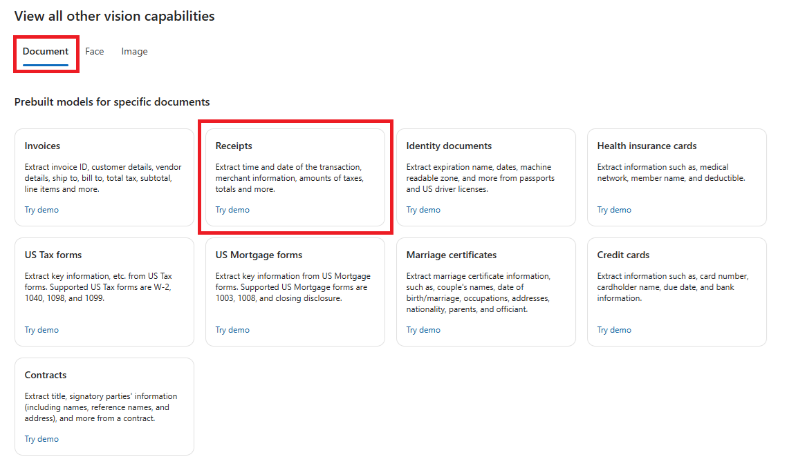
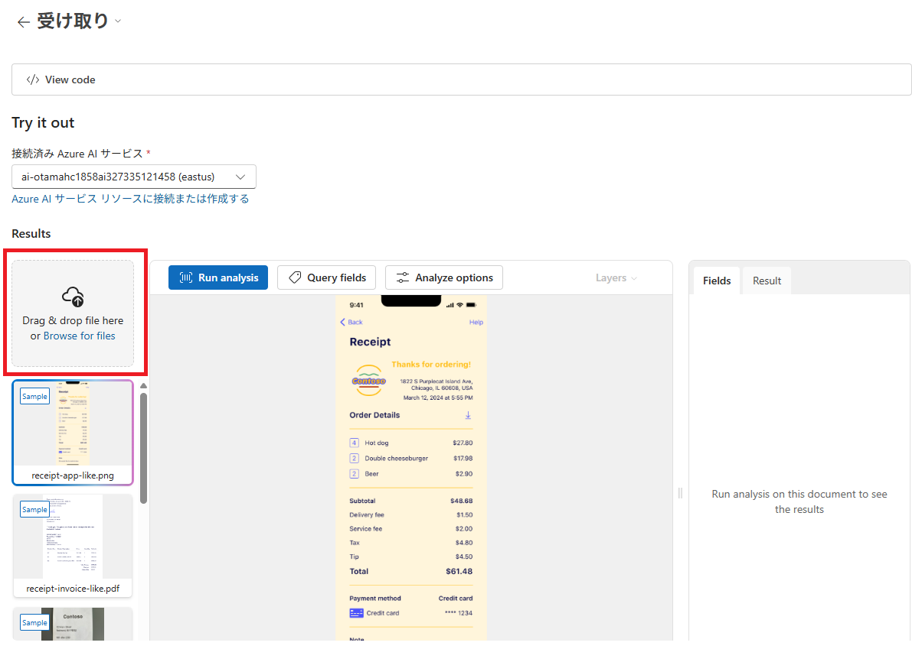
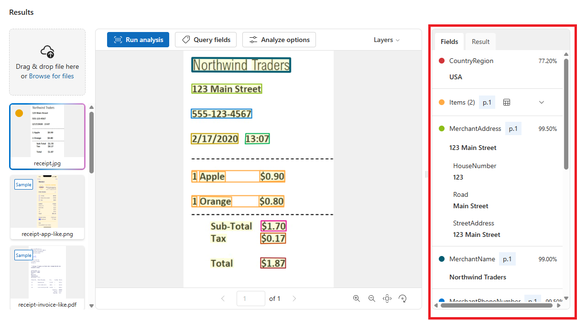

---
lab:
  title: 'ラボ 03: Extract data from document'
  module: Module04 Knowledge Mining
---

# ラボ 03 - Document Intelligenceを使用してドキュメントを分析する

## ラボ概要

Azure AI Document Intelligence は、フォームやドキュメントから情報を分析して抽出し、フィールド名とデータを識別できます。

このラボではレシートに記載された内容をDocument Intelligenceのモデルを使用して分析します。

## 推定時間 : 15 分

## ラボ環境の起動

このラボでは[Skillable](https://alh.learnondemand.net/)にて以下のラボを起動して実施してください。

​	**Explore generative AI in Azure AI Foundry Portal (JA) / Azure AI Foundry ポータルで生成 AI を探索する **

​	AI-900T00-A Microsoft Azure AI Fundamentals [Cloud Slice Provided] JAPANESE, Learning Path 05 (CSS)

1. ## タスク1 : プロジェクトの作成

   このタスクでは、Document Intelligenceを使用するために**プロジェクトとハブリソース** を作成します。 Azure AI Foundry では、プロジェクトを作業の整理を行うためのコンテナーとして使用します。

   1. Skillableのラボウィンドウで確認、取得したアカウント情報を使用して [**Azure AI Foundry Portal**](https://ai.azure.com/managementCenter/allResources)  (https://ai.azure.com/managementCenter/allResources) にサインインします。

      >**注:** ツアーやチュートリアルが表示される場合は、"キャンセル"もしくはポップアップの×ボタンをクリックして閉じます。
      >
      >Azure Portalの言語が英語になっている場合は、ログイン後の画面上部右側"歯車アイコン"をクリックし、画面左側の"Language + Regions"から日本語(Japanese)へ変更することが可能です。

   1. 管理センター上部に表示されている **新規作成** ボタンをクリックし、**プロジェクトの作成** 画面に移動します。

   1. **プロジェクトの作成** 画面では、 **AIハブリソース** を選択して **次へ** をクリックします。

      

   1. **新しいプロジェクトの作成** の画面が表示されたら、高度なオプションを展開して以下のパラメーターを設定します。
   
      | パラメーター       | 値                                                           |
      | ------------------ | ------------------------------------------------------------ |
      | プロジェクト名     | **project[アカウント名に含まれている数字8桁]** 例：アカウント名=LabUser-12345678@LODSPRODMCA.onmicrosoft.com であれば**project12345678** |
      | ハブ               | **hub[アカウント名に含まれている数字8桁]** 例：アカウント名=LabUser-12345678@LODSPRODMCA.onmicrosoft.com であれば**hub12345678** |
      | サブスクリプション | 既定値(MOC Subscription-lodXXXXXXXXなど)                     |
      | リソースグループ   | 既定値(rg-projectXXXXXXXXなど)                               |
      | リージョン         | **East US, France Central, Korea Central, West Europe, West US**のいずれかを選択 |

   1. **[作成]** をクリックしてプロジェクトの作成を開始します。

      ※プロジェクトの作成には時間を要する場合があります。概ね3-5分程度で作成が完了します。

   1. プロジェクトの作成が完了すると、 **Azure AI Foundry Portal** へ強制的に遷移します。

      >注：強制的に遷移されなかった場合は、以下のリンクにアクセスすることで確認可能です。
      >https://ai.azure.com/
   
   1. Azure AI Foundry Portalの左側に表示されるメニューから **AIサービス** を選択します。 
   
      
   
      > 注：AIサービスが表示されない場合は、AIハブリソースが作成されていない可能性があります。Azure Portal(https://portal.azure.com)に移動し、リソースグループ内にAIハブリソースが作成されているかを確認し、Azure AI Foudry、Azure AI Foudry Projectなど一部のリソースしか作成されていない場合はAzure AI Foundryプロジェクトが作成されている可能性があります。上記のハブ作成手順を確認し、再度実行してください。
   
   1. 移動した **Azure AI サービス** のページで **AI機能を使用してソリューションを活性化する** のセクションから **Visionとドキュメント** を選択します。
   
      
   
   1. **Vision + Document** の画面が表示され、Document Intelligenceの機能をテストすることが可能となっていることが確認できます。
   
      

## タスク 2 : ドキュメントの分析

このタスクでは、Document Intelligence を使用して事前構成済みのモデルでレシートの内容を分析します。

1. **View all other vision capabilities** セクションにて、 **Document** タブの **[Receipts]** のタイルをクリックします。

    

1. 分析対象となるレシートを用意します。今回は以下のURLより画像をダウンロードします。
    [**https://aka.ms/mslearn-receipt**](https://aka.ms/mslearn-receipt)

    ※右クリックで「名前を付けてリンク先を保存」を選択すること等でダウンロード可能です

1. ダウンロードしたレシート画像を読み込みます。画面左側の **[Browse for files]** をクリックし、ダウンロードしたファイルを選択します。

    

1. ファイルが読み込まれたことを確認して、 **[Run analysis]** をクリックして分析を開始します。

1. 分析が完了すると画面右側に結果が表示されます。 **[Field]** タブで各項目の読み取り内容、確度を確認することができます。一部のアイテム（今回は商品明細にあたる **Item** 欄）は省略されているため、展開することが詳細を確認できます。

    

以上でDocument Intelligence Studioを使用したラボは完了です！
