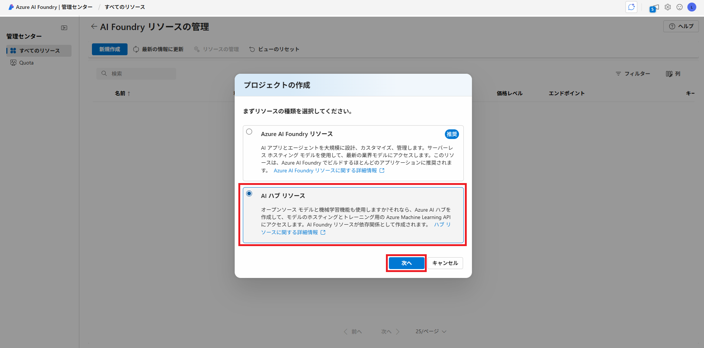
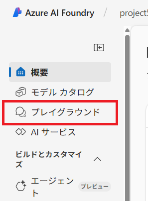
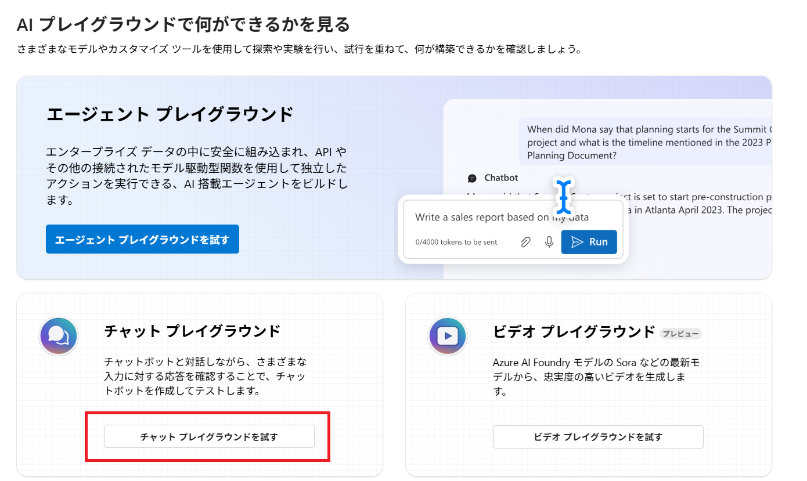
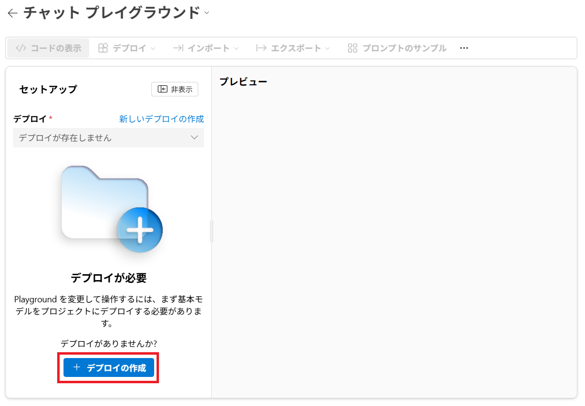
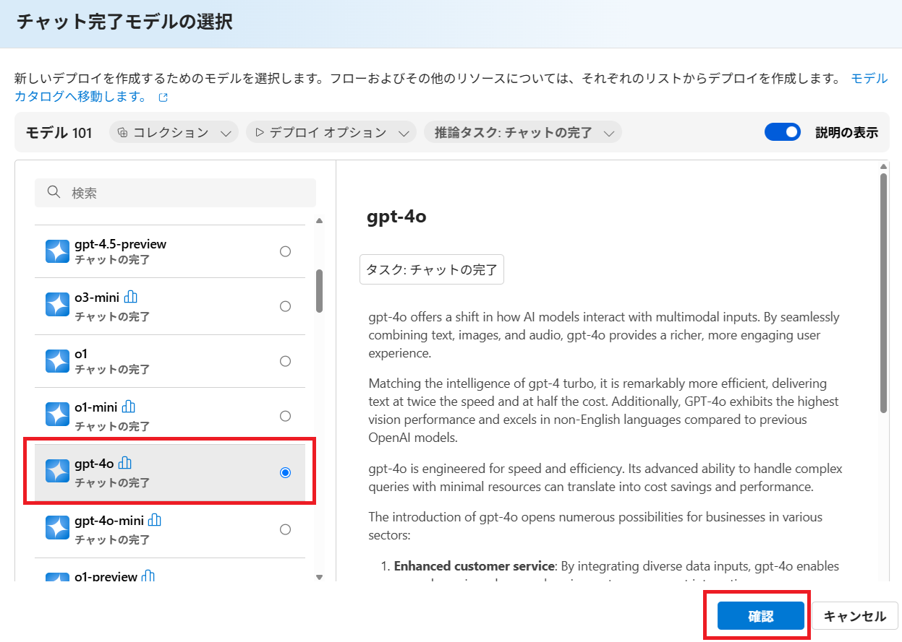
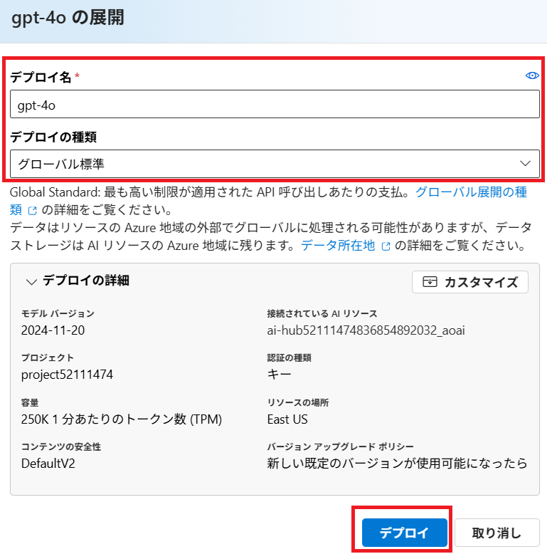
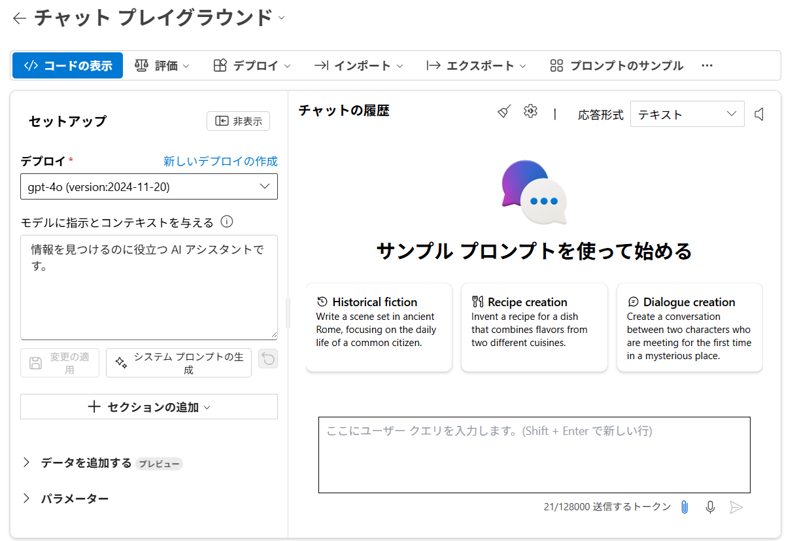
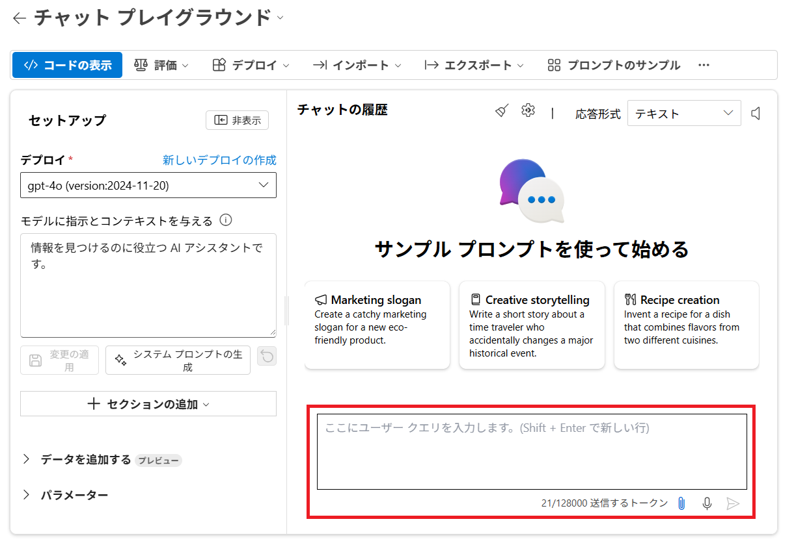
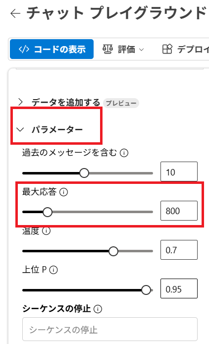
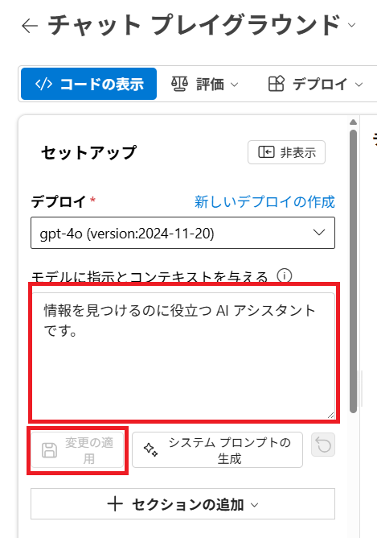

---
lab:
  title: 'ラボ 04: Explore generative AI'
  module: Module05 Generative AI
---

# ラボ 04 - 生成AIモデルをテストする

## ラボ概要

生成AI(Generative AI)はいくつかあるAIのカテゴリの中でも、新たなコンテンツ作成を行う機能をもつAIとなります。ここ数年で一般的に使用されているAIチャットと呼ばれるようなアプリケーションでは、生成AIモデルが組み込まれていることにより人間との自然な会話を実現しています。

このラボではAzure AI Foundry Portalで生成AIモデルの機能をテストします。

## 推定時間 : 25 分

## ラボ環境の起動

このラボでは[Skillable](https://alh.learnondemand.net/)にて以下のラボを起動して実施してください。

​	**Explore generative AI in Azure AI Foundry Portal (JA) / Azure AI Foundry ポータルで生成 AI を探索する **

​	AI-900T00-A Microsoft Azure AI Fundamentals [Cloud Slice Provided] JAPANESE, Learning Path 05 (CSS)

1. ## タスク1 : プロジェクトの作成とモデルの展開

   このタスクでは、生成AIモデルを展開するために**プロジェクトとハブリソース** を作成します。 Azure AI Foundry では、プロジェクトを作業の整理を行うためのコンテナーとして使用します。

   1. Skillableのラボウィンドウで確認、取得したアカウント情報を使用して [**Azure AI Foundry Portal**](https://ai.azure.com/managementCenter/allResources)  (https://ai.azure.com/managementCenter/allResources) にサインインします。

      >**注:** ツアーやチュートリアルが表示される場合は、"キャンセル"もしくはポップアップの×ボタンをクリックして閉じます。
      >
      >Azure Portalの言語が英語になっている場合は、ログイン後の画面上部右側"歯車アイコン"をクリックし、画面左側の"Language + Regions"から日本語(Japanese)へ変更することが可能です。

   1. 管理センター上部に表示されている **新規作成** ボタンをクリックし、**プロジェクトの作成** 画面に移動します。

   1. **プロジェクトの作成** 画面では、 **AIハブリソース** を選択して **次へ** をクリックします。

      

   1. **新しいプロジェクトの作成** の画面が表示されたら、高度なオプションを展開して以下のパラメーターを設定します。
   
      | パラメーター       | 値                                                           |
      | ------------------ | ------------------------------------------------------------ |
      | プロジェクト名     | **project[アカウント名に含まれている数字8桁]**<br />例：アカウント名=LabUser-12345678@LODSPRODMCA.onmicrosoft.com<br />であれば**project12345678** |
      | ハブ               | **hub[アカウント名に含まれている数字8桁]**<br />例：アカウント名=LabUser-12345678@LODSPRODMCA.onmicrosoft.com<br />であれば**hub12345678** |
      | サブスクリプション | 既定値(MOC Subscription-lodXXXXXXXXなど)                     |
      | リソースグループ   | 既定値(rg-projectXXXXXXXXなど)                               |
      | リージョン         | **East US, France Central, Korea Central, West Europe, West US**のいずれかを選択 |

   1. **[作成]** をクリックしてプロジェクトの作成を開始します。

      ※プロジェクトの作成には時間を要する場合があります。概ね3-5分程度で作成が完了します。

   1. プロジェクトの作成が完了すると、 **Azure AI Foundry Portal** へ強制的に遷移します。

       > 注：強制的に遷移されなかった場合は、以下のリンクにアクセスすることで確認可能です。
       > https://ai.azure.com/
   
   1. Azure AI Foundry Portalの左側に表示されるメニューから **プレイグラウンド** を選択します。 
   
      
   
   1. 移動した **プレイグラウンド** のページで **チャットプレイグラウンド** のセクションから **チャットプレイグラウンドを試す** を選択します。
   
      
   
   1. **チャットプレイグラウンド** の画面が表示されます。チャットを開始するには **モデル ** の作成が必要となるため、 **+デプロイの作成** をクリックしてモデルを作成します。
   
      
   
   1. **チャット完了モデルの選択** では、作成するモデルを選択することができます。今回のラボでは一覧から **gpt-4o** のモデルを選択して作成します。モデルを選択して **確認** のボタンをクリックします。
   
      
   
   1. **モデルの展開** 画面で、 **デプロイ名** の項目が選択したモデル名になっていること、 **デプロイの種類** が **「グローバル標準」** であることを確認して、 **デプロイ** のボタンをクリックします。
   
        
   
   1. モデルデプロイが完了するとチャットプレイグラウンドを使用したモデルのテストが行えるようになります。
   
        > 注：ページが自動で遷移しない場合はページの更新を行ってください
   
        
   
        

## タスク 2 : モデルのテスト

このタスクでは、チャットプレイグラウンドを使用してGPTモデルと会話し、システムメッセージやパラメータを調整することで得られる効果をテストします。

1. まずは簡単な会話を始めます。 **ここにユーザークエリを入力します。** のボックスにテキストを入力することで会話することができます。

    以下のプロンプト（入力）を送信します。

    ```prompt
    生成AIモデルについて教えて
    ```

    

1. 出力された内容を確認します。場合によっては途中で出力が切れてしまう可能性があります。その場合は **続きを出力して** と入力して送信することで残りの出力が表示されます。

    > 注：出力が完了しているか確かめたいときは **回答は最後まで出力されましたか？** と送信することで確認することが可能です。

1. 出力内容はほとんどの場合、数回に分けて出力されるはずです。これは出力の **最大トークン長** がパラメーターで定義されていることに起因します。
    これを引き上げることにより、長い出力も可能となります。
    チャットプレイグラウンドの画面左側に表示されている **セットアップ** セクションの **パラメーター** を展開し、 **最大応答** の値を引き上げます。

    デフォルト値の倍になるよう値を変更し、先ほどと同様にプロンプトを送信します。

    

1. 1回に出力される内容が以前よりも長くなっていることが確認できるはずです。これらのパラメーターは実際のアプリケーションではリクエストの一部として送信されるものになりますが、値を設定・変更することで出力結果に影響を与えることが可能です。

    > 注：出力されるトークン長を長くすることは、文章が切れずに出力されるメリットはありますが、それだけ多くのトークンが消費されることで課金額が増大する可能性があることに注意が必要です。

1. 次に **システムメッセージ** の効果についてテストします。 **セットアップ** セクションの **モデルに指示とコンテキストを与える** に記述する内容を変更することで、 モデルの大まかな挙動を制御することができます。

    > 注：これまでのチャットのやりとりをクリアするには **チャットの履歴** セクション上部にある **箒のアイコン** をクリックします。

1. 以下の内容を入力し、回答内容に変化があるかテストします。入力（変更）後は必ず **変更の適用** をクリックします。更新の確認ダイアログが出た場合は、そのまま **続行** をクリックします。

    ```prompt
    あなたは生成AIに関する質問に回答するAIアシスタントです。AIに関する概念や、生成AIモデル、生成AIを活用したサービスなどの情報を回答として出力します。生成AI以外に関する質問には回答しないでください。また、公平な立場をとるため、特定のサービスや企業名は回答に含めないでください。質問の内容が理解できない、回答を持ち合わせていない場合は、回答できないことを素直に伝えてください。
    ```

    

1. 先ほどと同じプロンプト（生成AIモデルについて教えて）を再度送信します。先ほどの出力内容とは異なり、特定のモデル名やサービス名は含まれない結果となっているはずです。

1. システムメッセージで指示された内容に正しく従っているかを再度テストします。以下のプロンプトを送信します。

    ```prompt
    具体的なモデル名やサービス名を教えてください
    ```

1. おそらく要求した内容は拒否されるはずです。システムメッセージではこのように回答内容を大まかに制御することが可能です。ただし、完全な制御を提供するものではない点に注意が必要です。システムメッセージはモデルによっては回避される恐れがあります。

1. プロンプトやパラメーターを変更して、挙動のテストを続けてください。また、 **セットアップ** セクションの **新しいデプロイの作成** から別のモデルを展開して切り替えながらテストすることも可能です。

    > 注：一部のモデルは使用できない場合があります

    

以上で生成AIモデルを使用したラボは完了です！
